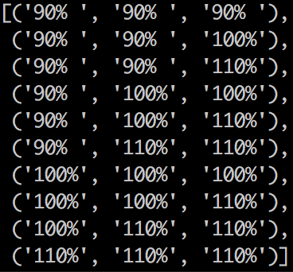

# CarND Controls PID
Self-Driving Car Engineer Nanodegree Program

---

This project is about a PID controller that needs to be implemented to be able to drive safely around the simulated track inside the [Udacity self driving car simulator](https://github.com/udacity/self-driving-car-sim).

The simulator provides the cross track error (CTE) and the velocity (mph) in order to compute the appropriate steering angle.


## What is a PID controller?
[A proportional–integral–derivative controller](https://en.wikipedia.org/wiki/PID_controller) (PID controller or three term controller) is a control loop feedback mechanism widely used in industrial control systems and a variety of other applications requiring continuously modulated control. The PID controller calculates a correction given a desired setpoint and the error feedback (In our case this is the cross track error CTE).

The controller consists of 3 components P (proportional), I (integral) and D (differential).

The proportional component tries to steer the vehicle back on to the track (Original trajectory).

The integral component tries to correct against a systematic error of the system ( For example the system might be biased to steer in one direction stronger than to the other).

The differential component steers against overshooting of the proportional component. This component will smooth out the steering of the vehicle.

For each of the component a parameter needs to be chosen to tweak the output of the controller. This is called parameter tuning and there are different techniques how to choose these parameters such as Sebastian Thrun's twiddle or gradient descent.


##Choosing the PID parameters

To find the PID parameters, I chose to write a python script that can automatically choose the parameters. For this I have extended the pid controller executable to take in commandline parameters P, I, D, duration (in telemetry frames). The throttle is being hardcoded inside the executable.

The approach I used is a combination of the twiddle algorithm and gradient descent. The python script I wrote (see optimize.py) starts with initialy chosen PID parameters. For each run it will calculate 9 sets of PID parameters and run the simulator with these. Pid executable outputs the total accumulated error after each run. This way we can compare the 'goodness' of the PID parameters and minimize on this error (Similar to the cost function output on gradient descent). This error is calculated by adding up all absolute values od the cross track error.

The 9 parameters are combinations of the input PID, where each parameter was increased or decreased by 10% or kept the same.

The generated change looks like this (Each tuple is the changed P,I,D):



This can be imagined as a cube on a 3 dimensional space where the axes are labeled P, I and D. The chosen value will be iteratively moved towards the minimal error of the 9 directions similar to the gradient descent method (8 + the position of the input).

The script will choose a new PID value, based on the minimal total accumulated error, that is outputted by the pid executable after each run. The simulator will be restart before each run (see `RestartSim()` in main.cpp) to keep the total accumulated error comparable.

After running the 9 PID values and selecting the best PID, the script will generate a new set of 9 PIDs and try run them through the simulator again.

This cycle will repeat itself until the user interrupts the process.

After running the script over multiple hours the chosen output was `PID = [0.7815647561804492, 0.0040939106276118775, 31.747072260867547]`. The process was tuned on a throttle value of 0.8 which is pretty high, thus the generated pid values are very aggresive on the steering.

## Limitations

The PID controller is limited by the maximum steering angle of 25 degrees into each direction. This is a problem when the vehicle speed is being increased. The PID controller will try to correct more aggresively and generate corrections beyond the 25 degree limitation. This causes the vehicle to drive off the road. To counter against this, I implemented a simple algorithm that will reduce the speed of the vehicle proportional to the pid controller correction if this is more than the 25 degree limitation of the vehicle. This way the PID controller will have more "time" to correct and get back to the center of the road.

## Results

I have tuned the parameters to drive as fast as possible on the track. As a result the PID controller is very aggressive on steering. I am able to reach a top speed of about 79 mph. See [video](assets/pid.mov).

## Dependencies

* cmake >= 3.5
 * All OSes: [click here for installation instructions](https://cmake.org/install/)
* make >= 4.1(mac, linux), 3.81(Windows)
  * Linux: make is installed by default on most Linux distros
  * Mac: [install Xcode command line tools to get make](https://developer.apple.com/xcode/features/)
  * Windows: [Click here for installation instructions](http://gnuwin32.sourceforge.net/packages/make.htm)
* gcc/g++ >= 5.4
  * Linux: gcc / g++ is installed by default on most Linux distros
  * Mac: same deal as make - [install Xcode command line tools]((https://developer.apple.com/xcode/features/)
  * Windows: recommend using [MinGW](http://www.mingw.org/)
* [uWebSockets](https://github.com/uWebSockets/uWebSockets)
  * Run either `./install-mac.sh` or `./install-ubuntu.sh`.
  * If you install from source, checkout to commit `e94b6e1`, i.e.
    ```
    git clone https://github.com/uWebSockets/uWebSockets 
    cd uWebSockets
    git checkout e94b6e1
    ```
    Some function signatures have changed in v0.14.x. See [this PR](https://github.com/udacity/CarND-MPC-Project/pull/3) for more details.
* Simulator. You can download these from the [project intro page](https://github.com/udacity/self-driving-car-sim/releases) in the classroom.

There's an experimental patch for windows in this [PR](https://github.com/udacity/CarND-PID-Control-Project/pull/3)

## Basic Build Instructions

1. Clone this repo.
2. Make a build directory: `mkdir build && cd build`
3. Compile: `cmake .. && make`
4. Run it: `./pid`. 

Tips for setting up your environment can be found [here](https://classroom.udacity.com/nanodegrees/nd013/parts/40f38239-66b6-46ec-ae68-03afd8a601c8/modules/0949fca6-b379-42af-a919-ee50aa304e6a/lessons/f758c44c-5e40-4e01-93b5-1a82aa4e044f/concepts/23d376c7-0195-4276-bdf0-e02f1f3c665d)
